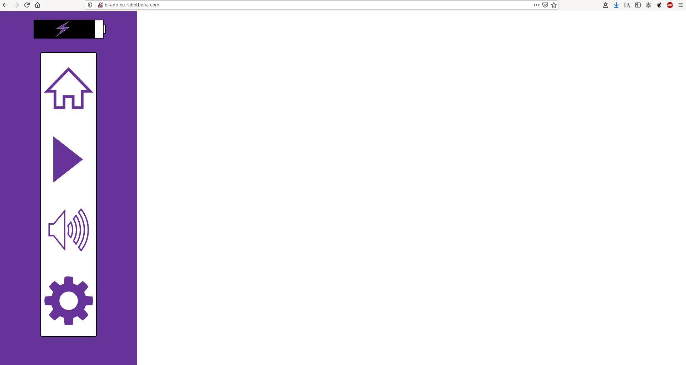

# OpenDoñita

OpenDoñita is a server designed to work with the **Conga 1490/1590** robotic vacuum cleaners distributed by **Cecotec**
in Spain. Since it is really a robot manufactured by the chinese company **robot bona**, it is very probable that it
would work with other robots.

All the documentation is in my personal blog: https://blog.rastersoft.com/?p=2324 (in spanish).

## Using OpenDoñita

To use it, you must first install your own DNS server in your internal network. I used a Raspberry Pi with *dnsmasq*.

Now, in the computer with the DNS, edit the file */etc/hosts* and add these two entries:

* 192.168.X.Y    bl-app-eu.robotbona.com
* 192.168.X.Y    bl-im-eu.robotbona.com

being 192.168.X.Y the IP address of the computer where the server will run (usually it should be the Raspberry Pi too).
This is a must because the robot connects to a server in those domains (which this project replaces), to receive from
them the commands. The Android/iPhone app doesn't send commands directly to the robot, but only to the server, and it
redirects them to the robot. Thus, to allow our local server to pose as the official one, we must redirect those two
domains to our own computer.

Now restart *hostapd* with *sudo systemctl restart hostapd* to ensure that it re-reads the configuration.

The next step is to change the DNS in your WiFi router to point to the *hostapd*. This is dependant on your specific router.

After doing this, entering those domains in your browser should return an error.

Now, copy all the files of this project in the computer choosen to be your own server, and launch it with:

    sudo ./congaserver.py

It is important to launch it as root because it needs to bind to the port 80, and only root can do that.

Now you can check if everything works by opening any of the previous domains in your browser. You should see this page:

## Connecting the robot to the new server

Now there are two ways of connecting the robot to the server:

* turn off the WiFi router and turn on again

* or turn off the robot and turn on it again

when you do it, you should see that, after several seconds, the Wifi light in the robot turns on. Now you can control it
from the new app.

## Using the app

In the main screen you have four buttons:

The *home* button: when it is filled of color, it means that the robot is not in the base. Clicking on it will send it
to the charger.

The *play* button: this triangle starts a new clean cycle, and will change to a square (or *stop*) button, which will
stop the clean cycle.

The *sound* button: this is an speaker, and pressing on it enables or disables the *beeps* emited by the robot.

The *settings* button: this button will open a popup where it is possible to choose the fan power, the water flux, and
the clean mode:

This configuration will be remembered even if the robot is turned off and on again.

## Pairing the robot manually

To pair the robot you need a computer with a WiFi adapter. First, put your robot in *pairing mode* by pressing the power
button until it sends a beep. The Wifi light will blink.

Now, in your computer, search for a WiFi network called *CongaGyro_XXXXXX* (if you are using a robot from another distributor,
the Wifi SSID can change) and connect to it (it has no password).

After connecting, run *./configconga.py WIFI_SSID WIFI_PASSWORD* (being WIFI_SSID and WIFI_PASSWORD the SSID and the password
of your Wifi network).

After about two seconds, your computer will be disconnected from that network, and the robot will connect to your WiFi.

## Author

Sergio Costas  
http://www.rastersoft.com  
rastersoft@gmail.com  
